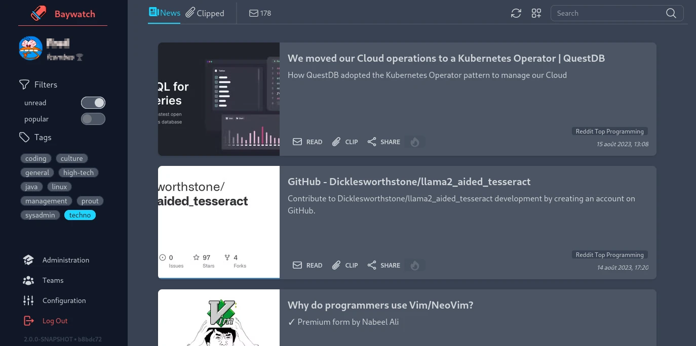

# Baywatch


Baywatch is an application that lets you keep an eye on the latest technology.
Simply hosted, Baywatch will scrape the news feeds that interest you at regular intervals to
provide you with the most relevant articles in a readable way.

Baywatch has a multitude of features, the main ones being

* **Article deduplication**\
  *Even if the same article is published in several news feeds,
  it will only appear once in your watch.*
* **News feed tagging**\
  *News feeds can now be tagged, making it easier to filter what you want to read.*
* **Team management**\
  *Baywatch lets you create teams with whom you can share the articles you've enjoyed.
  These articles will then appear in your teammates' watch.*
* **Read later**\
  *Mark an article for later reading.
  If you want to take the time to read it and test what it says.
  Or simply if you don't want to lose it.*
* **News feed search**\
  *The News Feed Search lets you find news feeds among all those already added by other
  Baywatch users.
  This powerful search suggests news feeds based on what users have posted on the feeds,
  increasing the quality of the results.*



## Installation

Baywatch is packaged as a docker image, and installation is insanely simple,
just start a container :

```shell
docker run --rm --name baywatch -d \
  -e BAYWATCH_HOME=/var/lib/baywatch \
  -v /tmp/testbaywatch/:/var/lib/baywatch/.baywatch \ 
  -v /tmp/testbaywatch/tmp:/tmp \ 
  -p 8082:8081 --read-only \ 
  marthym/baywatch:2.0.0-SNAPSHOT
```

Baywatch will automatically create the SQLite database in `BAYWATCH_HOME` and need be able to
write in `/tmp`

### Configure

Baywatch offers many configuration parameters, almost all of which are not mandatory.

| Env                            | Description                                             | Optional | Default Value |
|--------------------------------|---------------------------------------------------------|----------|---------------|
| BAYWATCH_COOKIE_VALIDITY       | The time the session cookie is valid                    | X        | 24h           |
| BAYWATCH_DNS_TIMEOUT           | The timeout duration for DNS query                      | X        | 10s           |
| BAYWATCH_GRAPHIQL_ENABLE       | Enable the GraphiQL interface                           | X        | false         |
| BAYWATCH_GRAPHQL_INTROSPECTION | Enable the GraphQL introspection                        | X        | false         |
| BAYWATCH_HOME                  | The path where BW will create database file             | -        |               |
| BAYWATCH_IMGPROXY_BASEPATH     | IMGProxy base path to allow reverse proxy               | X        | /img          |
| BAYWATCH_IMGPROXY_ENABLE       | Minify image with ImgProxy                              | X        | true          |
| BAYWATCH_IMGPROXY_SALT         | IMGProxy signing salt                                   | X        | -             |
| BAYWATCH_IMGPROXY_SIGNKEY      | IMGProxy signing key                                    | X        | -             |
| BAYWATCH_INDEXER_ENABLE        | Enable lucene to index news end feed                    | X        | true          |
| BAYWATCH_LOG_LEVEL             | Change the log level                                    | X        | INFO          |
| BAYWATCH_SCRAPER_CONSERVATION  | The time the news was conserved since their publication | X        | 3 month       |
| BAYWATCH_SCRAPER_ENABLE        | Start the feeds scraping at start up                    | X        | true          |
| BAYWATCH_SCRAPER_FREQUENCY     | The frequency of the scraping process                   | X        | 1h            |
| BAYWATCH_SCRAPER_TIMEOUT       | The timeout duration for scraping news or feed          | X        | 2s            |
| BAYWATCH_SERVER_PORT           | Change the server port                                  | X        | 8080          |
| BAYWATCH_TOKEN_VALIDITY        | The time the JWToken is valid                           | X        | 1h            |

### Docker compose

A [docker-compose.yaml](docker-compose.yml) file provides an example of a complete Baywatch
server configuration, with ImgProxy for image minification and a grafana stack for observability.
Please note, however, that this is an example file, not a production configuration.
It will be necessary to secure the installation more reliably for production.

## Contribute

Baywatch is based on Springboot 3 and uses the Webflux model. Spring serves both the frontend
and backend, but it is advisable to place them behind a proxy for caching purposes.

In order to compile and run the Baywatch code, it is necessary to have installed versions 
later than or equal to **Java 17**, **Node 18** and **Maven 3**.

### Sandside

Sandside is the backend of Baywatch. Developed according to the hexagonal architecture,
the module is divided into business components:

* **admin**: Baywatch's administration domain
* **common**: Tools required by other business components
* **indexer**: Manages the indexing and searching of articles and news feeds
* **notify**: Handles asynchronous communication with application clients
* **opml**: Manages OMPL files
* **scraper**: Contains all scraping machinery for news feeds
* **security**: Manages application security and users
* **teams**: Contains team management
* **techwatch**: Manages all aspects of technology watch

### Seaside

Seaside is the Baywatch front end. Developed from Vue.js v3 with Tailwind as CSS framework
and DaisyUI as component framework.

### Build

The complete build of the application (front and back) is done with the command:
`mvn clean package jib:dockerBuil`.
