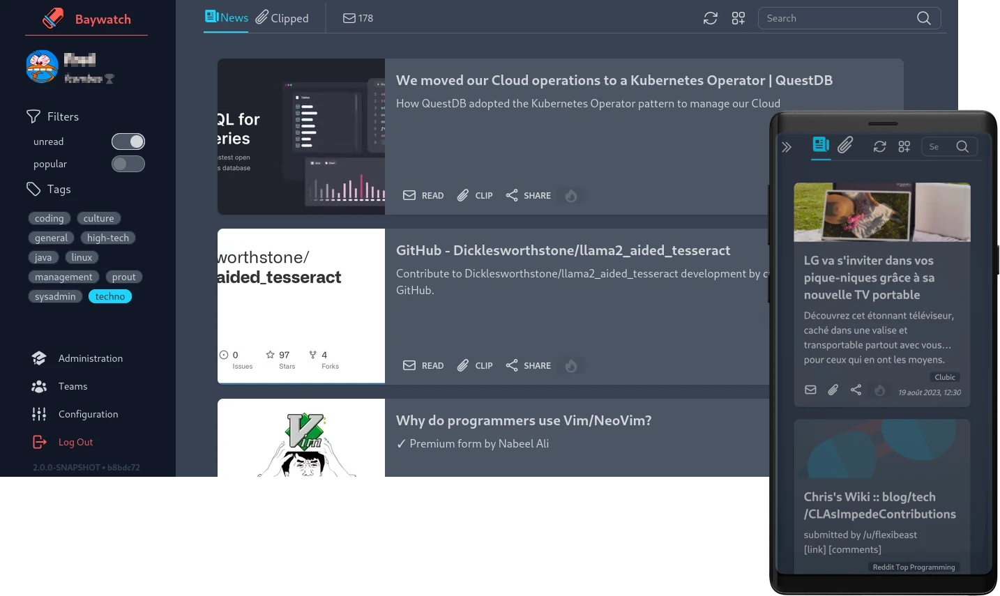

# Baywatch

Baywatch is an application that lets you keep an eye on the latest technology.
Simply hosted, Baywatch will scrape the news feeds that interest you at regular intervals to 
provide you with the most relevant articles in a readable way.

Baywatch has a multitude of features, the main ones being

* **Article deduplication**\
  *Even if the same article is published in several news feeds, 
   it will only appear once in your watch.*
* **News feed tagging**\
  *News feeds can now be tagged, making it easier to filter what you want to read.*
* **Team management**\
  *Baywatch lets you create teams with whom you can share the articles you've enjoyed. 
   These articles will then appear in your teammates' watch.*
* **Read later**\
  *Mark an article for later reading. 
   If you want to take the time to read it and test what it says.
   Or simply if you don't want to lose it.*
* **News feed search**\
  *The News Feed Search lets you find news feeds among all those already added by other 
  Baywatch users.
  This powerful search suggests news feeds based on what users have posted on the feeds, 
  increasing the quality of the results.*

## Installation

### Configure

## Contribute

### Application structure
### Used libraries
### Reports

